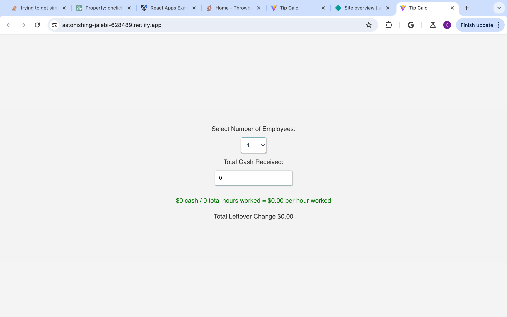
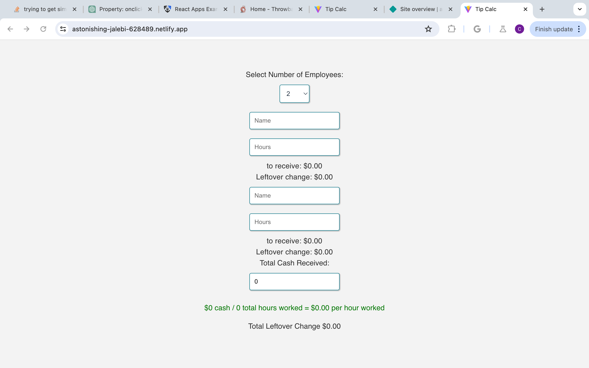
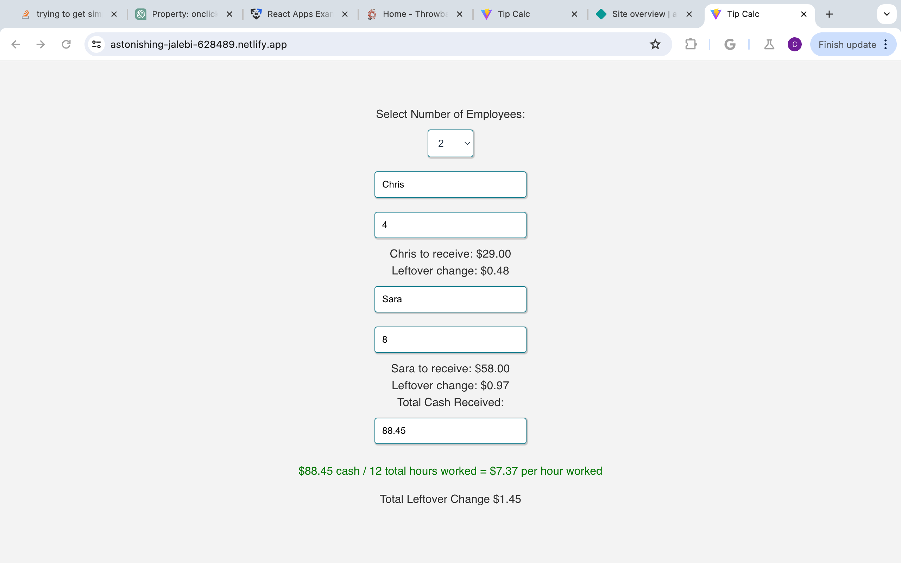

# walkings-still-honest
Book search engine

# React Tip Disbursement Calculator

## Table of Content

- [Description](#description)
- [Usage](#usage)
- [Features](#features)
- [Prerequisites](#prerequisites)
- [Installation](#installation)
- [Running the Application](#running-the-application)
- [Technical Details](#technical-details)
- [Acknowledgements](#acknowledgements)
- [License](#license)

## Description

The tip disbursement calculator was developed to simplify the process of distributing shared cash tips among employees. It allows users to enter the total shared cash tips received during a shift and the number of hours each employee worked. The calculator then provides a breakdown of the tip distribution, taking into account the number of hours worked by each employee and rounding any leftover change.  As of right now the app rounds all change down, because our kitchen gets the leftover change put toward their "party fund"

## Usage

To use the calculator:
1. Enter the total shared cash tips received during the shift.
2. Enter the name of each employee and the number of hours they worked.
3. Click the calculate button to see the tip distribution breakdown.

## Features

- Easy to use interface
- Takes into account up to 20 employees
- Takes in name of employee
- Takes number of hours work per employee
- Gives full breakdown of calculation as well as rounded leftover change

### Prerequisites

- React/Vite
- MaterialUI
- Node.js and npm (Node Package Manager)

### Installation

no installation needed yet.  
hope to use Native.js for future use via Apple iOS and app store

### Running the Application

Run through already deployed site:
https://astonishing-jalebi-628489.netlify.app/

## Screenshots of Project

## Technical Details

## Acknowledgements

Special thanks to:

Referenced following websites:
- https://stackoverflow.com
- https://www.w3schools.com

Special thanks to ChatGPT, the AI Learning Assistant, for providing valuable assistance and guidance.
Lada Jerabek, with out you I would not be able to do ANY of this.  Thank you.

## License

---MIT License

Copyright (c) [2023] [Christopher Robert Naro]

Permission is hereby granted, free of charge, to any person obtaining a copy
of this software and associated documentation files (the "Software"), to deal
in the Software without restriction, including without limitation the rights
to use, copy, modify, merge, publish, distribute, sublicense, and/or sell
copies of the Software, and to permit persons to whom the Software is
furnished to do so, subject to the following conditions:
The above copyright notice and this permission notice shall be included in all
copies or substantial portions of the Software.
THE SOFTWARE IS PROVIDED "AS IS", WITHOUT WARRANTY OF ANY KIND, EXPRESS OR
IMPLIED, INCLUDING BUT NOT LIMITED TO THE WARRANTIES OF MERCHANTABILITY,
FITNESS FOR A PARTICULAR PURPOSE AND NONINFRINGEMENT. IN NO EVENT SHALL THE
AUTHORS OR COPYRIGHT HOLDERS BE LIABLE FOR ANY CLAIM, DAMAGES OR OTHER
LIABILITY, WHETHER IN AN ACTION OF CONTRACT, TORT OR OTHERWISE, ARISING FROM,
OUT OF OR IN CONNECTION WITH THE SOFTWARE OR THE USE OR OTHER DEALINGS IN THE
SOFTWARE.
🏆 The previous sections are the bare minimum, and your project will ultimately determine the content of this document. You might also want to consider adding the following sections.